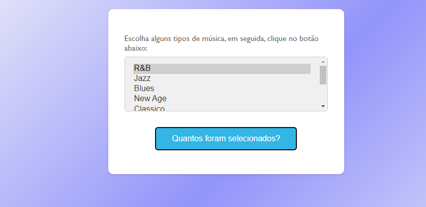

### Seleção de Música: Um Projeto Interativo em HTML, CSS e JavaScript

    Este projeto permite que os usuários selecionem vários tipos de música em um menu suspenso e, em seguida, cliquem em um botão para ver quantos tipos foram selecionados.

## Tecnologias Utilizadas:

    HTML: Para estruturar o conteúdo da página e criar o formulário.
    CSS: Para estilizar os elementos da página e criar uma interface visual atraente.
    JavaScript: Para capturar a interação do usuário e calcular o número de tipos de música selecionados.

## Funcionalidades:

    Menu suspenso com diversos tipos de música para seleção.
    Botão para contar o número de tipos de música selecionados.
    Interface amigável e intuitiva.
    Código limpo e organizado.

## Como Usar:

    Abra o arquivo index.html em um navegador web.
    Selecione os tipos de música desejados no menu suspenso.
    Clique no botão "Quantos foram selecionados?" para ver a quantidade de tipos selecionados.

## Observações:

    Este projeto é um exemplo simples e pode ser expandido com mais funcionalidades, como a exibição de uma lista dos tipos de música selecionados ou a reprodução de músicas de acordo com as escolhas do usuário.
    O código JavaScript pode ser adaptado para atender às suas necessidades específicas.

    Tornar o código mais responsivo para se adaptar a diferentes tamanhos de tela.
    Este projeto é um ótimo ponto de partida para quem deseja aprender a criar interfaces interativas com HTML, CSS e JavaScript.

## Contato

 github: luan18alencar
 
# Imagens do projeto

